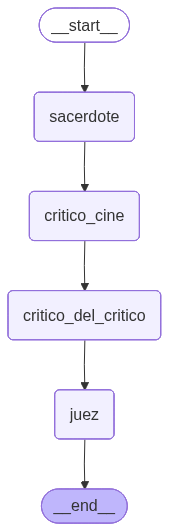

# 🤖 A2A Debate — Sistema Multi-Agente de Debate Cultural

> **Sistema de debate orquestado entre 4 agentes especializados que implementan el protocolo A2A (Agent-to-Agent)** 
>
> Cada agente aporta una perspectiva única: moral/espiritual, artística, crítica y judicial. El resultado es un debate coherente y enriquecido donde los agentes iteran y se desafían mutuamente.

---

## 📋 Tabla de Contenidos

1. [¿Qué es este proyecto?](#qué-es-este-proyecto)
2. [Arquitectura del Sistema](#arquitectura-del-sistema)
3. [Instalación y Configuración](#instalación-y-configuración)
4. [Modos de Ejecución](#modos-de-ejecución)
5. [Cómo Funciona](#cómo-funciona)
6. [Estructura de Archivos](#estructura-de-archivos)
7. [Ejemplos de Uso](#ejemplos-de-uso)
8. [Preguntas Frecuentes](#preguntas-frecuentes)

---

## ¿Qué es este proyecto?

Un **sistema multi-agente que simula un debate cultural** donde:

- **⛪ Agente Sacerdote:** Analiza desde la perspectiva moral y espiritual
- **🎬 Agente Crítico de Cine:** Analiza desde lo artístico y cinematográfico
- **🔥 Agente Crítico del Crítico:** Desafía y cuestiona los argumentos del crítico
- **⚖️ Agente Juez:** Evalúa todas las perspectivas y emite veredicto

### Ejemplo de flujo:

```
Tema: "La película Oppenheimer: ¿obra maestra o sobrevalorada?"
                        ↓
⛪ Sacerdote: "Desde la ética, cuestiono los riesgos nucleares que plantea..."
                        ↓
🎬 Crítico: "Artísticamente es magnífica, pero el sacerdote omite el aspecto..."
                        ↓
🔥 Contra-Crítico: "El crítico tiene un sesgo elitista, el público normal busca..."
                        ↓
⚖️ Juez: "La perspectiva más válida es... porque..."
```

---


## Arquitectura del Sistema

### Diagrama de Flujo


```
┌──────────────────────────────────────────────────────────────────┐
│ Usuario ingresa tema                                             │
└──────────────────────────────────────────────────────────────────┘
                            ↓
┌──────────────────────────────────────────────────────────────────┐
│ RegistroA2A (Orquestador Central)                                │
│ • Registra 4 agentes                                             │
│ • Gestiona descubrimiento (Agent Cards)                          │
│ • Maneja comunicación entre agentes (protocol A2A)               │
└──────────────────────────────────────────────────────────────────┘
                            ↓
┌──────────────────────────────────────────────────────────────────┐
│ StateGraph (LangGraph)                                           │
│ • Nodo 1: Sacerdote (lee tema) → opina                           │
│ • Nodo 2: Crítico (lee opinión anterior) → analiza              │
│ • Nodo 3: Contra-crítico (lee ambas) → cuestiona                │
│ • Nodo 4: Juez (lee todas) → emite veredicto                    │
└──────────────────────────────────────────────────────────────────┘
                            ↓
┌──────────────────────────────────────────────────────────────────┐
│ Generación de Respuesta (LangChain + OpenAI GPT-4o-mini)         │
│ • Cada handler invoca al LLM con su rol específico               │
│ • Respuestas se almacenan en estado compartido (DebateState)     │
└──────────────────────────────────────────────────────────────────┘
                            ↓
┌──────────────────────────────────────────────────────────────────┐
│ Resultado Final → resultado_debate.json + Impresión por pantalla │
└──────────────────────────────────────────────────────────────────┘
```

---

## 🚀 Instalación y Configuración

### 1. **Requisitos Previos**

- **Python 3.12+**
- **Poetry** (gestor de dependencias) o **pip + venv**
- **Cuenta OpenAI** (acceso a la API)
- **OPENAI_API_KEY** (tu clave de API)

### 2. **Clonar el Repositorio**

```bash
cd c:\Henry\Modulo_3
git clone <repo-url>
cd first-agent2agent
```

### 3. **Configurar Variables de Entorno**

Crea un archivo `.env` en la raíz del proyecto:

```bash
# .env
OPENAI_API_KEY=sk-xxx...tu-clave-aqui...xxx
```

**⚠️ Importante:**
- La API key es **gratuita hasta cierto límite** (primeros $5 USD)
- No necesitas registrarte en FastAPI ni en ningún otro servicio
- Solo necesitas la clave de OpenAI
- Las primeras pruebas son gratis

### 4. **Instalar Dependencias**

Con **Poetry** (recomendado):

```bash
poetry install
```

Con **pip** (alternativa):

```bash
python -m venv venv
venv\Scripts\activate
pip install -r requirements.txt
```

---

## 🎯 Modos de Ejecución

### **Modo 1: Interactivo (Terminal) — SIN FastAPI**

```bash
uv run python -m src.a2a_debate
```

**Qué sucede:**
1. El programa te pide un tema por terminal
2. Se ejecuta el debate localmente (sin servidor)
3. Imprime los 4 pasos del debate por pantalla
4. Guarda el resultado en `resultado_debate.json`
5. Se cierra

**Ventaja:** Rápido, no necesita servidor, perfecto para probar.

**Ejemplo:**
```
🎙️  Ingresa el tema del debate:
   Default: 'La película Oppenheimer: ¿obra maestra o sobrevalorada?'

   👉 La IA en la educación: ¿beneficio o riesgo?

[ejecuta el debate...]

⛪ FASE 1: PERSPECTIVA DEL SACERDOTE
━━━━━━━━━━━━━━━━━━━━━
Desde la ética, la IA plantea dilemas...

[... más fases ...]

💾 Resultado guardado en: resultado_debate.json
```

---

### **Modo 2: Servidor HTTP (FastAPI)**

```bash
uv run python -m src.a2a_debate --server
```

**Qué sucede:**
1. Se inicia un **servidor HTTP** en `localhost:8000`
2. El servidor queda corriendo (no se cierra)
3. Puedes hacer peticiones HTTP desde clientes externos

**Ventaja:** Permite que otros programas o clientes HTTP interactúen con el sistema.

**Endpoints disponibles:**

```bash
# 1. Descubrir agentes disponibles
GET http://localhost:8000/.well-known/agent-cards

# 2. Obtener info de un agente específico
GET http://localhost:8000/agents/sacerdote/.well-known/agent-card.json
GET http://localhost:8000/agents/critico_cine/.well-known/agent-card.json
GET http://localhost:8000/agents/critico_del_critico/.well-known/agent-card.json
GET http://localhost:8000/agents/juez/.well-known/agent-card.json

# 3. Iniciar un debate
POST http://localhost:8000/debate
Content-Type: application/json

{
  "tema": "La inteligencia artificial en la medicina"
}
```

**Ejemplo con curl:**

```bash
# Iniciar debate desde otra terminal
curl -X POST http://localhost:8000/debate \
  -H "Content-Type: application/json" \
  -d '{"tema": "¿Debería ser obligatorio el uso de IA en escuelas?"}'
```

**Documentación interactiva:**
- Swagger UI: `http://localhost:8000/docs`
- ReDoc: `http://localhost:8000/redoc`

---

## ¿Cuándo usar cada modo?

| Modo | Cuándo usar |
|------|------------|
| **Interactivo (sin servidor)** | Desarrollo local, pruebas rápidas, scripts automatizados |
| **Servidor HTTP** | Integración con otros sistemas, API pública, demo web |

**La mayoría de las veces usarás el modo interactivo.**

---

## 🧠 Cómo Funciona

### Paso 1: Registro de Agentes

```python
# src/a2a_debate.py
registro.registrar("sacerdote", AGENT_CARDS["sacerdote"], handler_sacerdote)
registro.registrar("critico_cine", AGENT_CARDS["critico_cine"], handler_critico_cine)
# ...etc
```

Cada agente se registra con:
- **Agent Card:** Metadatos (nombre, skills, versión)
- **Handler:** Función que lo "controla"

### Paso 2: Descubrimiento

```python
card = registro.descubrir("sacerdote")  # Obtiene Agent Card
```

Simula el protocolo A2A: `GET /.well-known/agent-card.json`

### Paso 3: Comunicación

```python
response = await registro.enviar_mensaje("sacerdote", prompt)
```

Simula el protocolo A2A: `POST / con method: message/send`

**Lifecycle de la tarea:**
```
submitted → working → completed (o failed)
```

### Paso 4: Invocación del LLM

```python
async def handler_sacerdote(texto: str, ctx: str) -> str:
    messages = [
        SystemMessage(content="Eres un sacerdote reflexivo..."),
        HumanMessage(content=texto)
    ]
    response = await llm.ainvoke(messages)
    return response.content
```

- **SystemMessage:** Define el rol/personaje
- **HumanMessage:** La pregunta/tarea
- **ainvoke:** Llamada asincrónica al LLM

### Paso 5: Agregación de Estado

```python
# src/grafo.py
async def nodo_sacerdote(state):
    # Lee: estado["tema"]
    # Invoca: handler_sacerdote
    # Devuelve: {"opinion_sacerdote": resultado, ...}
    # ↓ El estado se actualiza automáticamente

async def nodo_critico_cine(state):
    # Lee: estado["tema"] + estado["opinion_sacerdote"] ANTERIOR
    # Incluye ambas en su prompt para contexto
    # Devuelve: {"critica_cine": resultado, ...}
```

**Concepto clave:** El `DebateState` es un "portapapeles" que viaja entre nodos. Cada nodo lee lo anterior y agrega lo suyo.

---

## 📁 Estructura de Archivos

```
first-agent2agent/
├── main.py                    # Punto de entrada simple (vacío)
├── pyproject.toml            # Configuración de proyecto (Poetry)
├── requirements.txt          # Dependencias (pip)
├── .env                       # Variables de entorno (crear)
├── resultado_debate.json      # Resultado del último debate (auto-generado)
├── README.md                  # Este archivo
├── visualizar_grafo.py        # Script para visualizar el grafo (opcional)
│
└── src/
    ├── __init__.py
    ├── config.py              # 🔧 Configuración global (LLM, logging)
    ├── agent_cards.py         # 🏷️  Identidad de cada agente (metadatos)
    ├── handlers.py            # 🧠 Lógica de cada agente (invocación al LLM)
    ├── registro_a2a.py        # 📋 Orquestador central (descubrimiento + comunicación)
    ├── grafo.py               # 🔗 StateGraph (flujo entre agentes)
    ├── a2a_debate.py          # 🎙️  Punto de entrada + servidor FastAPI
    └── cliente_a2a.py         # 🌐 Cliente HTTP (para llamadas remotas)
```

### Responsabilidades de cada archivo

| Archivo | Responsabilidad |
|---------|-----------------|
| **config.py** | Cargar `.env`, inicializar LLM (OpenAI), logging |
| **agent_cards.py** | Definir Agent Cards (metadatos de agentes) |
| **handlers.py** | Crear SystemMessage + invocar LLM por cada agente |
| **registro_a2a.py** | Registrar agentes, simular protocolo A2A |
| **grafo.py** | Definir nodos (4 agentes) + flujo entre ellos |
| **a2a_debate.py** | Orquestar el debate + exponer endpoints FastAPI |
| **cliente_a2a.py** | Cliente HTTP para consumir los endpoints |

---

## 💡 Ejemplos de Uso

### Ejemplo 1: Ejecutar en Modo Interactivo

```bash
# Terminal
uv run python -m src.a2a_debate

# Salida esperada:
# 🎙️  Ingresa el tema del debate...
# [Usuario ingresa: "La IA en la educación"]
# 
# [Se ejecuta el debate]
# ⛪ FASE 1: PERSPECTIVA DEL SACERDOTE
# ━━━━━━━━━━━━━━━━━━━━━━━━━━━━━━━━
# [respuesta del sacerdote]
# 
# 🎬 FASE 2: CRÍTICA CINEMATOGRÁFICA
# ...y así sucesivamente
```

### Ejemplo 2: Ejecutar Servidor

```bash
# Terminal 1: Iniciar servidor
uv run python -m src.a2a_debate --server
# Servidor escuchando en http://localhost:8000

# Terminal 2: Hacer petición
curl -X POST http://localhost:8000/debate \
  -H "Content-Type: application/json" \
  -d '{"tema": "¿Debería ser obligatorio usar IA en la educación?"}'
```

### Ejemplo 3: Usar el Cliente

```python
# En un script Python
import asyncio
from src.cliente_a2a import ClienteA2A

async def main():
    cliente = ClienteA2A("http://localhost:8000")
    
    # Descubrir agentes
    agentes = await cliente.descubrir_agentes()
    print(agentes)
    
    # Iniciar debate
    resultado = await cliente.iniciar_debate("La IA en medicina")
    print(resultado)
    
    await cliente.cerrar()

asyncio.run(main())
```
---

## 🛠️ Desarrollo y Extensión

### Agregar un 5º agente (Historiador)

1. **En `agent_cards.py`:**
```python
"historiador": {
    "name": "📚 Agente Historiador",
    "description": "Analiza desde la perspectiva histórica",
    "skills": [{
        "id": "historia",
        "name": "Análisis Histórico",
        "description": "Contextualiza temas en la historia",
    }],
}
```

2. **En `handlers.py`:**
```python
async def handler_historiador(texto: str, ctx: str) -> str:
    messages = [
        SystemMessage(content="Eres un historiador..."),
        HumanMessage(content=texto),
    ]
    response = await llm.ainvoke(messages)
    return response.content
```

3. **En `grafo.py`:**
```python
async def nodo_historiador(state):
    # Similar a otros nodos
    ...

def construir_grafo_debate():
    grafo.add_node("historiador", nodo_historiador)
    grafo.add_edge("critico_del_critico", "historiador")  # Nuevo orden
    grafo.add_edge("historiador", "juez")
```

4. **En `a2a_debate.py`:**
```python
registro.registrar("historiador", AGENT_CARDS["historiador"], handler_historiador)
```

---

## 📚 Referencias

- **LangChain:** https://python.langchain.com/
- **LangGraph:** https://langchain-ai.github.io/langgraph/
- **FastAPI:** https://fastapi.tiangolo.com/
- **OpenAI API:** https://platform.openai.com/docs/api-reference
- **Protocolo A2A:** https://spec.agent-protocol.org/

---

## 📝 Licencia

Este proyecto es de educación. Úsalo libremente.

---

## Author

**Joaquín Olivero** ~ Software Engineer

[](https://www.linkedin.com/in/JoaquinOlivero)
[](https://github.com/Pulpoide)
